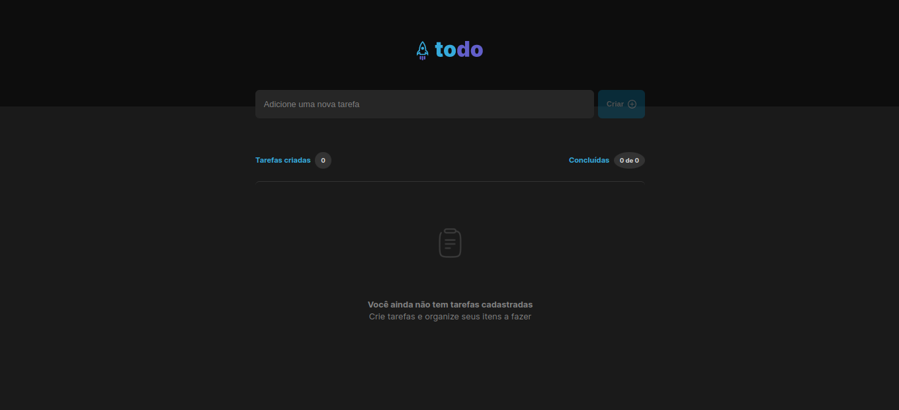
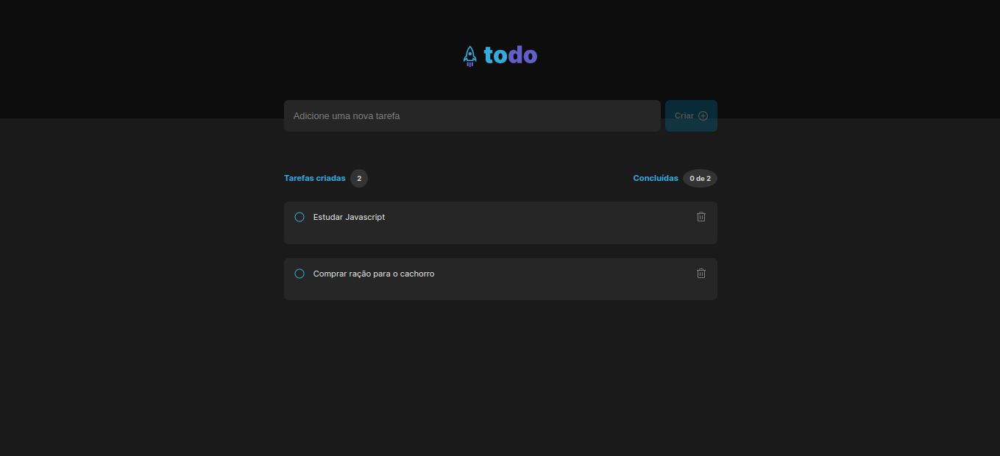
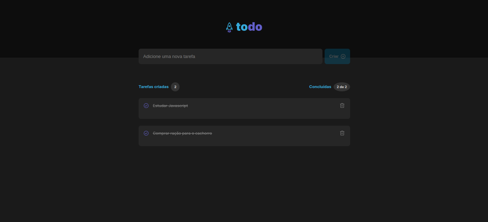

# Desafio 1 - Ignite ReactJS - ToDoList

> Trilha Ignite Rocketseat

Projeto construido com base nos conceitos adquiridos no módulo 1 do curso.

  <a href="#-tecnologias">Tecnologias</a>&nbsp;&nbsp;&nbsp;|&nbsp;&nbsp;&nbsp;
  <a href="#-projeto">Projeto</a>&nbsp;&nbsp;&nbsp;|&nbsp;&nbsp;&nbsp;
  <a href="#-layout">Layout</a>&nbsp;&nbsp;&nbsp;|&nbsp;&nbsp;&nbsp;

 

[Clique aqui para acessar](https://to-do-list-bruno.vercel.app/)

## 🚀 Tecnologias

Esse projeto foi desenvolvido com as seguintes tecnologias:

- [ReactJS](https://pt-br.reactjs.org/)
- [Javascript](https://developer.mozilla.org/pt-BR/docs/Web/JavaScript)
- [CSS3](https://developer.mozilla.org/pt-BR/docs/Web/CSS)
- [HTML5](https://developer.mozilla.org/pt-BR/docs/Web/HTML)
- [CSSModules](https://github.com/css-modules/css-modules)
- [phosphor-react-icons](https://phosphoricons.com/)

## 💻 Projeto

Nesse desafio, desenvolvemos  uma aplicação de controle de tarefas no estilo **to-do list**, que contém as seguintes funcionalidades:

- Adicionar uma nova tarefa
- Marcar e desmarcar uma tarefa como concluída
- Remover uma tarefa da listagem
- Mostrar o progresso de conclusão das tarefas

## 🔖 Layout

Você pode visualizar o layout do projeto através [desse link](https://www.figma.com/file/Zr1ThX2Tl5CG9pQmC7P6Jj/ToDo-List-(Copy)?node-id=0%3A1). É necessário ter conta no [Figma](https://figma.com) para acessá-lo.

---

Feito com ♥ by Bruno Gonçalves Ferreira

## Desenvolvedores/Contribuintes :

Responsável pelo desenvolvimento do projeto

[ Bruno Gonçalves Ferreira](https://github.com/brunogoncalvesferreira)

Copyright : 2022 - ToDoList com ReactJS

